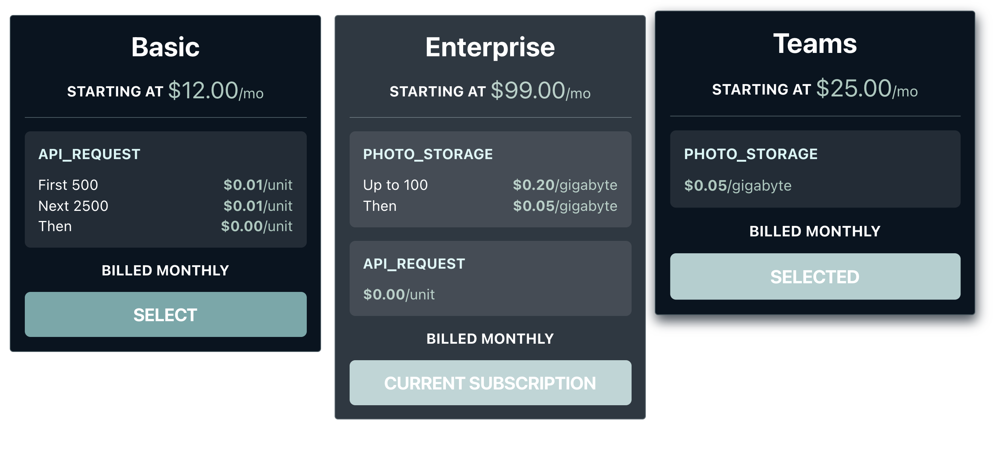
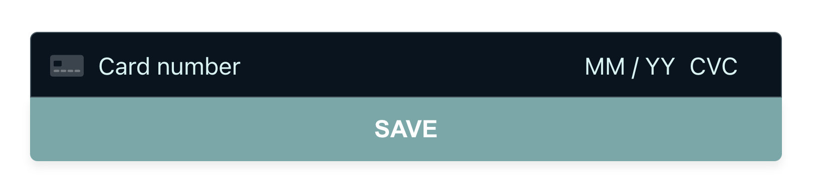

# octane-components <!-- omit in toc -->
[](https://www.npmjs.com/package/octane-components) [](https://standardjs.com)
[](https://www.getoctane.io/)

Ready-to-use React components that make it easy to integrate with **[Octane](https://www.getoctane.io/)**

- [Getting started](#getting-started)
  - [TL;DR](#tldr)
  - [Getting a customer token](#getting-a-customer-token)
- [Standard Components](#standard-components)
  - [`PlanPicker`](#planpicker)
  - [`PaymentSubmission`](#paymentsubmission)
- [Advanced Components](#advanced-components)
  - [`TokenProvider`](#tokenprovider)
  - [`StripeElements`](#stripeelements)
- [Styling components](#styling-components)
- [Actions](#actions)
  - [`getActiveSubscription(token): Promise<PricePlan | null>`](#getactivesubscriptiontoken-promisepriceplan--null)
  - [`hasPaymentInfo(token): Promise<boolean>`](#haspaymentinfotoken-promiseboolean)
  - [`subscribeCustomer(token, plan, options): Promise<ActiveSubscription>`](#subscribecustomertoken-plan-options-promiseactivesubscription)
- [Types](#types)
- [Local development](#local-development)
- [License](#license)

## Getting started

`octane-components` has a collection of React components and actions (utility methods) to make integrating Octane into your UI simple. It works like this:

1. On your backend, use your Octane API key to request a customer token.
2. Pass this token to your client-side app and provide it to one of our components.
3. The components handle the rest.

### TL;DR

To demonstrate `octane-components`, we have a fully-functional example app that lives in the `example/` directory. But in short:

```bash
## Install using yarn:
yarn add octane-components

## or NPM:
npm install --save octane-components
```

```tsx
// And then use octane-components in your app.
import React from 'react';

import { PlanPicker, Actions } from 'octane-components';
import 'octane-components/dist/components/globals.css';
import 'octane-components/dist/components/PlanPicker/PlanPicker.css';

// /token is your token endpoint. See "Getting a customer token" below.
fetch('/token')
  .then((resp) => resp.json())
  .then((data) => {
    const { token } = data;
    ReactDOM.render(
      <PlanPicker
        customerToken={token}
        onPlanSelect={(plan) => Actions.subscribeCustomer(token, plan))}
      />,
      document.getElementById('root')
    );
  });
```

### Getting a customer token

A customer token is a short-lived token that allows our components to take action on behalf of a customer. You can fetch one by sending a POST request to the `/ecp/token` endpoint using your Octane API key (more on that [here][api-auth]).

**You should not send your Octane API key to the client**. Your API key can make arbitrary changes to any part of your Octane account and should be kept secret. Instead, you will need to expose a token endpoint that your client-side app can hit in order to fetch a customer token.

Here's an example of what that might look like in a hypothetical Express.js web server:

```js
const axios = require('axios');
const express = require('express');
const app = express();

app.get('/token', (req, res) => {
  // Get the ID of your currently signed-in user.
  const userId = getSignedInUser();
  axios
    .post(
      `https://api.cloud.getoctane.io/ecp/token`,
      {
        customer_name: userId,
      },
      {
        headers: {
          Authorization: `Bearer [YOUR API KEY HERE]`,
        },
      }
    )
    .then((apiRes) => {
      res.json(apiRes.data);
    })
    .catch((error) => {
      console.error(error);
      res.status(500);
      res.send('Something went wrong!');
    });
});

app.listen(3000);
```

## Standard Components

Components are interactive building blocks that handle interacting with specific parts of Octane. Most of them only need a customer token in order to work. By default they are unstyled, although they all include default styles that you can use and customize.

### `PlanPicker`

PlanPicker renders a list of plans available to a customer. If a customer is subscribed to an available plan, that plan is marked as the current subscription. Plans are selectable and fire a callback when they're selected.

```jsx
import { PlanPicker } from 'octane-components';
// CSS variables
import 'octane-components/dist/components/globals.css';
// Default theme
import 'octane-components/dist/components/PlanPicker/PlanPicker.css';

<PlanPicker
  // (Required) Your customer token.
  customerToken={token}
  // (Optional) Callback to fire when a plan is selected.
  onPlanSelect={(planName, plan) => {
    /* callback body */
  }}
/>;
```



### `PaymentSubmission`

PaymentSubmission renders a form to accept payment information from a customer. If the customer has payment information on file, the component indicates as much. PaymentSubmission is a wrapper around Stripe's [CardElement component][card-element], but takes care of interacting with Stripe, initializing Stripe's API, and setting up a Stripe payment intent.

```jsx
import { PaymentSubmission } from 'octane-components';
// CSS variables
import 'octane-components/dist/components/globals.css';
// Default theme
import 'octane-components/dist/components/PaymentSubmission/PaymentSubmission.css';

<PaymentSubmission
  // (Required) Your customer token.
  customerToken={token}
  // (Optional) Callback to fire when a payment method is set.
  //   Fires on component init if the customer has payment info on file.
  onPaymentSet={() => {
    /* callback body */
  }}
  // (Optional) The text to show on the "save payment" button. Defaults to "Save"
  saveButtonText={'Save'}
  //
  // The following are props provided by Stripe's CardElement.
  //
  // (Optional) An options object to pass to the underlying CardElement
  //   This can be used to style the CardElement, among other things.
  //   See: https://stripe.com/docs/js/elements_object/create_element?type=card
  options={{}}
  // (Optional) Change event handler to pass to the underlying CardElement
  //   See: https://stripe.com/docs/js/element/events/on_change?type=cardElement
  onChange={(event) => {
    /* callback body */
  }}
  // (Optional) Event handler triggered when the CardElement is fully rendered.
  //   Called with a reference to the underlying Element instance.
  //   See: https://stripe.com/docs/js/element
  onReady={(element) => {
    /* callback body */
  }}
  // (Optional) Triggered whenever the escape key is pressed inside the CardElement.
  onEscape={() => {
    /* callback body */
  }}
/>;
```



## Advanced Components

While our basic components are flexible enough for most common use cases, we also provide access to a number of more specific components to allow for more fine-tuned customization.

**All of our Advanced Components must be wrapped in a `TokenProvider` component.** Unlike our basic components, our advanced components expect the customer token to be provided through a React context which we expose through the `TokenProvider` component.

### `TokenProvider`

`TokenProvider` accepts a customer token as its value and makes it available to any of its children.

```jsx
<TokenProvider token={customerToken}>
  <YourCustomOctaneComponent />
</TokenProvider>
```

### `StripeElements`

`StripeElements` makes it easy to use any of Stripe's own [Elements][stripe-elements] components. It acts as a drop-in replacement to their own `<Elements>` wrapper, but it instead uses your Octane credentials to initialize the Stripe SDK.

```jsx
import { StripeElements } from 'octane-components';
import { CardElement } from '@stripe/react-stripe-js';

const MyComponent = ({ customerToken }) => (
  <TokenProvider token={customerToken}>
    <StripeElements>
      <CardElement />
    </StripeElements>
  </TokenProvider>
);
```

While it is initializing, `StripeElements` does not render anything. If you'd like to render a loading element, you can provide it via the `loading` prop:

```jsx
const MyComponent = ({ customerToken }) => (
  <TokenProvider token={customerToken}>
    <StripeElements loading={<LoadingSpinner />}>
      <CardElement />
    </StripeElements>
  </TokenProvider>
);
```

Additionally, we also expose a `useStripeClientSecret` hook that can be called from within the `StripeElements` component. The hook provides access to the Stripe client secret, which allows you to make Stripe API calls. Because it is initialized and owned by `StripeElements`, it can only be used by components within it. Here's an example (for more details on using Stripe's components, please refer to [their docs][stripe-elements]).

```jsx
import { StripeElements, useStripeClientSecret } from 'octane-components';
import { useStripe, useElements, CardElement } from '@stripe/react-stripe-js';

const MyForm = () => {
  const stripe = useStripe();
  const elements = useElements();
  const secret = useStripeClientSecret();

  const handleSubmit = async (event) => {
    event.preventDefault();

    if (!stripe || !elements || !secret) {
      // Stripe.js has not yet loaded.
      // Make sure to disable form submission until Stripe.js has loaded.
      return;
    }

    const result = await stripe.confirmCardSetup(secret, {
      payment_method: { card: elements.getElement(CardElement) },
    });

    if (result.error) {
      /* show error */
    } else {
      /* the payment has been processed! */
    }
  };

  const isDisabled = !stripe || !elements || !secret;

  return (
    <form onSubmit={handleSubmit}>
      <CardElement />
      <button disabled={isDisabled}>Confirm order</button>
    </form>
  );
};

const MyComponent = ({ customerToken }) => (
  <TokenProvider token={customerToken}>
    <StripeElements>
      <MyForm />
    </StripeElements>
  </TokenProvider>
);
```

## Styling components

By default, components are unstyled. They are decorated with classes that should make it easy to style them to match any sort of branding.

To provide a starting point, each component comes with its own default stylesheet. Each stylesheet depends on CSS variables scoped to the `.octane-component` class. To use a stylesheet, import both the variables and a component's stylesheet wherever you'd like to use them.

```css
/* index.css */

/* variables */
@import 'octane-components/dist/components/globals.css';
/* PlanPicker styles */
@import 'octane-components/dist/components/PlanPicker/PlanPicker.css';
/* PaymentSubmission styles */
@import 'octane-components/dist/components/PaymentSubmission/PaymentSubmission.css';
```

You can tweak our styling without writing new styles from scratch by overwriting our variables:

```css
/* variables */
@import 'octane-components/dist/components/globals.css';

/* overrides */
.octane-component {
  /* Light theme */
  --octane-bg-primary: #d4f5f54d;
  --octane-text-primary: #071420;
  --octane-border-primary: #c7dcd5;
  --octane-text-accent: #128475;
  --octane-bg-secondary: #becbd8;
  --octane-bg-lighter: #484e5980;
  --octane-text-secondary: #282c2c;
  --octane-border-primary: #d4f5f54d;
}

/* PlanPicker styles */
@import 'octane-components/dist/components/PlanPicker/PlanPicker.css';
/* PaymentSubmission styles */
@import 'octane-components/dist/components/PaymentSubmission/PaymentSubmission.css';
```

## Actions

In addition to components, `octane-components` provides access to "actions", or asynchronous interactions with our API. While these complement our React components nicely, they can be used in any client-side app. They all return Promises and work well with `await`, when available.

### `getActiveSubscription(token): Promise<PricePlan | null>`

`getActiveSubscription` checks for a customer's active subscription. If it's there, it resolves to the `PricePlan` details for that subscription. If the customer has no subscription, it resolves to `null`.

**Example**

```js
import { Actions } from 'octane-components';
const { getActiveSubscription } = Actions;

const planName = 'enterprise_plan';

fetch('/token')
  .then((resp) => resp.json())
  .then(({ token }) => getActiveSubscription(token))
  .then((sub) =>
    sub !== null ? alert('yeah') : alert('customer needs a subscription')
  );
```

**Params**

- `token` _(required, string)_ — A customer token.

### `hasPaymentInfo(token): Promise<boolean>`

`hasPaymentInfo` resolves to `true` if the customer has payment info, and `false` otherwise.

**Example**

```js
import { Actions } from 'octane-components';
const { hasPaymentInfo } = Actions;

const planName = 'enterprise_plan';

fetch('/token')
  .then((resp) => resp.json())
  .then(({ token }) => hasPaymentInfo(token))
  .then((hasIt) => (hasIt ? alert('yeah') : alert('need payment info')));
```

**Params**

- `token` _(required, string)_ — A customer token.

### `subscribeCustomer(token, plan, options): Promise<ActiveSubscription>`

`subscribeCustomer` subscribes a customer to a specific plan. It accepts a customer token and the name of a plan, and will subscribe that customer to the version of that plan visible to octane-components.

**Example**

```js
import { Actions } from 'octane-components';
const { subscribeCustomer } = Actions;

const planName = 'enterprise_plan';

fetch('/token')
  .then((resp) => resp.json())
  .then(({ token }) => subscribeCustomer(token, planName));
```

> Note that `checkForBillingInfo` is a convenience check and does not guarantee that valid billing info will be available in the future. For example, a customer could remove their payment information, or their payment details might expire.

**Params**

- `token` _(required, string)_ — A customer token.
- `plan` _(required, string)_ — The name of the plan to subscribe the customer to
- `options` _(optional, object)_ — Optional configuration options
  - `options.checkForBillingInfo` _(optional, boolean)_ — Whether or not to verify that there is valid payment information for the customer before subscribing them. Defaults to `false`.

## Types

`octane-components` is written entirely in TypeScript and makes heavy use of Octane's schema types throughout the code. To make accessing them easy, we've made these types accessible:

```ts
import type { SchemaTypes } from 'octane-components';
type PricePlan = SchemaTypes['PricePlan'];
```

These types are generated directly from our [OpenAPI schema file](https://api.cloud.getoctane.io/docs/openapi.json).

## Local development

The easiest thing to do is to run `yarn storybook`, which will let you see and edit all of our components.

It can also be useful to develop alongside the example app that lives in `example/`.

Here are the other commands to know about:

```bash
# Run a full build once. This checks types and puts built code in dist/
yarn build
# Start a build server, rebuilding any time a file changes
yarn start
# Run all of our tests
yarn test
# Run the storybook server in development / watch mode
yarn storybook
# Build storybook once
yarn build-storybook
# Fetch our openapi spec and generate fresh TypeScript types
yarn generate
```

## Releasing

Releasing is as easy as bumping the version of package.json in this repo. Any changes on the main branch will be automatically published to NPM.

## License

MIT © [Octane Software Technology, Inc.](https://getoctane.io)

[api-auth]: https://octane.readme.io/docs/api-authentication
[card-element]: https://stripe.com/docs/payments/integration-builder-card
[stripe-elements]: https://stripe.com/docs/payments/elements
